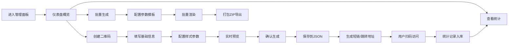

## 1. 产品概述

内网二维码生成与管理平台，面向企业内部运维、运营、市场人员，提供动态二维码、扫码统计、批量生成、导出打包等完整能力。解决静态二维码无法变更、缺乏数据追踪、批量制作效率低的痛点。

## 2. 核心功能

### 2.1 用户角色
| 角色 | 注册方式 | 核心权限 |
|------|----------|----------|
| 管理员 | 内网IP白名单/默认账号 | 全部功能：创建、编辑、删除、导出、查看统计 |

### 2.2 功能模块
1. **仪表盘首页**：总览卡片（二维码总数、今日扫码、累计扫码）、近期趋势图、快速创建入口
2. **二维码管理**：列表展示、新建/编辑/删除、启用/停用、二维码预览、复制短链
3. **创建二维码**：静态码 / 动态码两种模式，自定义尺寸、颜色、Logo
4. **扫码统计**：次数统计、时间分布图表、Top排行、时间范围筛选
5. **批量生成**：上传参数模板 / 在线编辑参数表，批量生成带不同参数的二维码
6. **导出中心**：单个下载、批量打包ZIP、导出统计报表CSV

### 2.3 页面详情
| 页面名称 | 模块名称 | 功能描述 |
|-----------|-------------|---------------------|
| 仪表盘 | 数据概览卡片 | 总数/今日/累计扫码、活跃码数，大数字带渐变背景 |
| 仪表盘 | 趋势折线图 | 近7天/30天扫码次数趋势，鼠标悬停显示详情 |
| 仪表盘 | 快速操作区 | 创建二维码、批量生成、导出中心的快捷入口按钮 |
| 二维码列表 | 搜索筛选栏 | 按名称/类型/状态筛选，关键词搜索 |
| 二维码列表 | 数据表格 | ID/名称/类型/目标URL/扫码次数/状态/创建时间/操作列 |
| 二维码列表 | 行内操作 | 编辑、预览弹窗、复制短链、启用/停用、删除、导出 |
| 创建二维码 | 基础表单 | 名称、类型（静态/动态）、目标URL、短链自定义 |
| 创建二维码 | 样式配置 | 尺寸滑块、前景色/背景色色盘、容错等级、上传Logo |
| 创建二维码 | 实时预览 | 右侧实时渲染二维码效果，支持放大查看 |
| 统计详情 | 核心指标 | 累计扫码、今日扫码、本周扫码、平均每日 |
| 统计详情 | 时间分布图 | 柱状图展示按天/按小时的扫码分布 |
| 统计详情 | 扫码记录表格 | 最近N条扫码时间、IP、User-Agent |
| 批量生成 | 参数配置 | 基础URL + 参数名 + 参数值列表（换行分隔） |
| 批量生成 | 预览表 | 展示将生成的二维码参数列表，支持删除单行 |
| 批量生成 | 进度条 | 生成进度显示，完成后一键打包下载 |
| 导出中心 | 任务列表 | 历史导出任务，包含时间、数量、大小、下载按钮 |

## 3. 核心流程

用户登录系统 → 仪表盘查看概览 → 点击创建二维码 → 填写名称和URL → 配置样式（尺寸/颜色/Logo）→ 实时预览效果 → 确认生成 → 列表中查看新码 → 扫码触发统计记录 → 进入统计页查看图表 → 需要批量时进入批量生成 → 配置参数模板 → 批量生成并打包下载。

## 4. 用户界面设计

### 4.1 设计风格
- **主色**：科技蓝 `#1677FF` 渐变至 `#00B8D9`，体现专业与工具感
- **辅助色**：成功绿 `#52C41A`、警告橙 `#FA8C16`、危险红 `#FF4D4F`
- **背景**：深色模式为主 `#0F172A → #1E293B` 线性渐变，配网格纹理
- **按钮风格**：圆角 8px，主按钮渐变背景带光晕 hover 效果
- **字体**：标题 `Space Grotesk` 现代几何无衬线，正文 `PingFang SC / Microsoft YaHei`
- **布局**：左侧导航栏（240px）+ 顶部面包屑 + 主内容卡片式布局
- **图标**：Lucide 线性图标，二维码模块点缀点阵装饰图形

### 4.2 页面设计概览
| 页面名称 | 模块名称 | UI元素 |
|-----------|-------------|-------------|
| 仪表盘 | 数据卡片 | 渐变背景 + 大数字 + 趋势小箭头 + 点阵装饰边框 |
| 仪表盘 | 趋势图 | Chart.js 折线图，渐变填充区域，动画加载 |
| 二维码列表 | 表格行 | 斑马纹悬停高亮，状态用彩色Tag标签，操作列图标按钮 |
| 创建二维码 | 表单 | 分组卡片，标签左对齐，输入框聚焦蓝色发光边框 |
| 创建二维码 | 预览区 | 圆角卡片，二维码居中，背景与前景色实时同步 |
| 统计详情 | 图表 | 柱状图渐变条，tooltip 自定义卡片，动画入场 |
| 批量生成 | 预览表 | 可编辑表格，参数行支持增删，进度带动画 |

### 4.3 响应式
桌面优先（1440px），次要适配 1024px 平板；移动端折叠左侧导航为汉堡菜单，表格转为卡片列表。

### 4.4 动效细节
- 页面加载：卡片 100ms 错峰淡入上移
- 悬停：卡片轻微上浮 + 阴影加深 + 渐变边框流动
- 扫码数字：从0滚动到目标值的数字计数动画
- 图表：柱子/线条从底部生长动画
