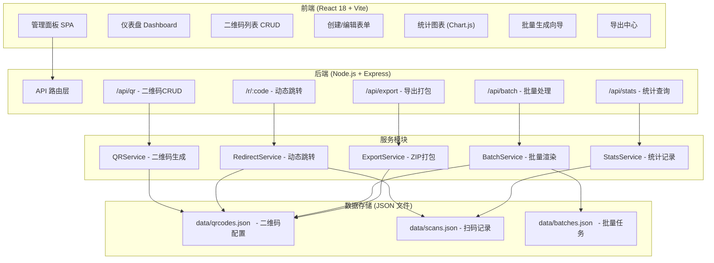
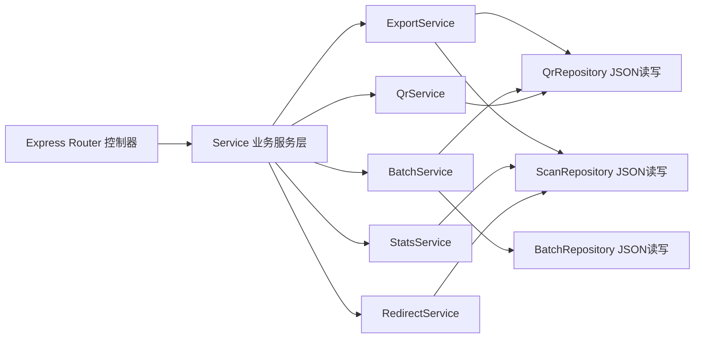
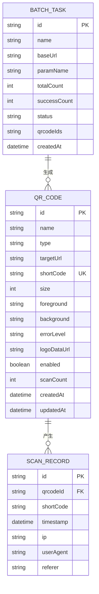

## 1. 架构设计



## 2. 技术描述

- **前端**：React@18 + React Router@6 + TypeScript + Vite@5
- **UI 样式**：TailwindCSS@3 + Lucide React 图标
- **图表**：Chart.js@4 + react-chartjs-2
- **二维码**：前端 `qrcode.react` 预览 + 后端 `qrcode` 生成 PNG Buffer
- **初始化工具**：Vite 官方 React-TS 模板
- **后端**：Node.js@18 + Express@4 + CORS
- **打包**：Archiver (ZIP)
- **数据库**：纯 JSON 文件存储，低写入量场景采用 read-modify-write + fs 原子写入
- **进程通信**：单进程 Node，无需消息队列

## 3. 路由定义

### 前端路由
| 路由路径 | 页面组件 | 用途 |
|----------|----------|------|
| `/` | Dashboard | 仪表盘总览 |
| `/qrcodes` | QrCodeList | 二维码列表管理 |
| `/qrcodes/new` | QrCodeCreate | 创建新二维码 |
| `/qrcodes/:id/edit` | QrCodeEdit | 编辑二维码 |
| `/qrcodes/:id/stats` | QrCodeStats | 单码统计详情 |
| `/batch` | BatchGenerator | 批量生成向导 |
| `/export` | ExportCenter | 导出中心 |

### 后端路由
| 方法 + 路由 | 用途 |
|-------------|------|
| `GET /api/qrcodes` | 分页查询二维码列表 |
| `GET /api/qrcodes/:id` | 获取单个二维码详情 |
| `POST /api/qrcodes` | 创建二维码 |
| `PUT /api/qrcodes/:id` | 更新二维码（含改URL） |
| `DELETE /api/qrcodes/:id` | 删除二维码 |
| `PATCH /api/qrcodes/:id/toggle` | 启用/停用二维码 |
| `GET /api/qrcodes/:id/image.png` | 下载二维码图片 |
| `GET /api/stats/overview` | 仪表盘总览数据 |
| `GET /api/stats/trend?days=7` | 扫码趋势按天 |
| `GET /api/stats/qrcode/:id` | 单码统计 |
| `GET /api/stats/qrcode/:id/records` | 单码扫码记录 |
| `POST /api/batch/preview` | 预览批量参数列表 |
| `POST /api/batch/generate` | 执行批量生成 |
| `GET /api/export/qrcodes.zip?ids=1,2,3` | 打包下载多个二维码 |
| `GET /api/export/stats.csv?id=1` | 导出统计CSV |
| `GET /r/:shortCode` | 动态短链跳转 + 记录统计 |

## 4. API 类型定义

```typescript
// 二维码配置
interface QrCode {
  id: string;
  name: string;
  type: 'static' | 'dynamic';
  targetUrl: string;
  shortCode: string;
  size: number;
  foreground: string;
  background: string;
  errorLevel: 'L' | 'M' | 'Q' | 'H';
  logoDataUrl?: string;
  enabled: boolean;
  scanCount: number;
  createdAt: string;
  updatedAt: string;
}

// 扫码记录
interface ScanRecord {
  id: string;
  qrcodeId: string;
  shortCode: string;
  timestamp: string;
  ip: string;
  userAgent: string;
  referer?: string;
}

// 批量任务
interface BatchTask {
  id: string;
  name: string;
  baseUrl: string;
  paramName: string;
  totalCount: number;
  successCount: number;
  status: 'pending' | 'running' | 'done' | 'failed';
  qrcodeIds: string[];
  createdAt: string;
}

// 创建请求
interface CreateQrCodeRequest {
  name: string;
  type: 'static' | 'dynamic';
  targetUrl: string;
  shortCode?: string;
  size?: number;
  foreground?: string;
  background?: string;
  errorLevel?: 'L' | 'M' | 'Q' | 'H';
  logoDataUrl?: string;
}

// 批量生成请求
interface BatchGenerateRequest {
  name: string;
  baseUrl: string;
  paramName: string;
  paramValues: string[];
  template: Partial<CreateQrCodeRequest>;
}

// 仪表盘总览
interface OverviewStats {
  totalQrCodes: number;
  activeQrCodes: number;
  totalScans: number;
  todayScans: number;
  thisWeekScans: number;
  topQrCodes: { id: string; name: string; scanCount: number }[];
  trendByDay: { date: string; count: number }[];
}
```

## 5. 后端服务分层



控制器只负责 HTTP 参数解析和响应序列化，所有业务逻辑下沉到 Service 层。Repository 层封装 JSON 文件的原子读写，确保并发写入安全（使用简单文件锁/串行队列）。

## 6. 数据模型

### 6.1 ER 图


### 6.2 JSON 文件结构

**data/qrcodes.json**
```json
{
  "version": 1,
  "items": [
    {
      "id": "qr_abc123",
      "name": "官网首页",
      "type": "dynamic",
      "targetUrl": "https://intranet.example.com/home",
      "shortCode": "HOME01",
      "size": 300,
      "foreground": "#000000",
      "background": "#FFFFFF",
      "errorLevel": "M",
      "enabled": true,
      "scanCount": 128,
      "createdAt": "2026-06-01T08:30:00.000Z",
      "updatedAt": "2026-06-10T14:22:00.000Z"
    }
  ]
}
```

**data/scans.json**
```json
{
  "version": 1,
  "items": [
    {
      "id": "scan_xyz789",
      "qrcodeId": "qr_abc123",
      "shortCode": "HOME01",
      "timestamp": "2026-06-11T09:15:32.000Z",
      "ip": "192.168.1.105",
      "userAgent": "Mozilla/5.0 (iPhone; CPU iPhone OS 17_0)",
      "referer": ""
    }
  ]
}
```

**data/batches.json**
```json
{
  "version": 1,
  "items": [
    {
      "id": "batch_001",
      "name": "2026年工位贴码",
      "baseUrl": "https://intranet.example.com/desk",
      "paramName": "id",
      "totalCount": 100,
      "successCount": 100,
      "status": "done",
      "qrcodeIds": ["qr_a1", "qr_a2"],
      "createdAt": "2026-06-05T10:00:00.000Z"
    }
  ]
}
```
